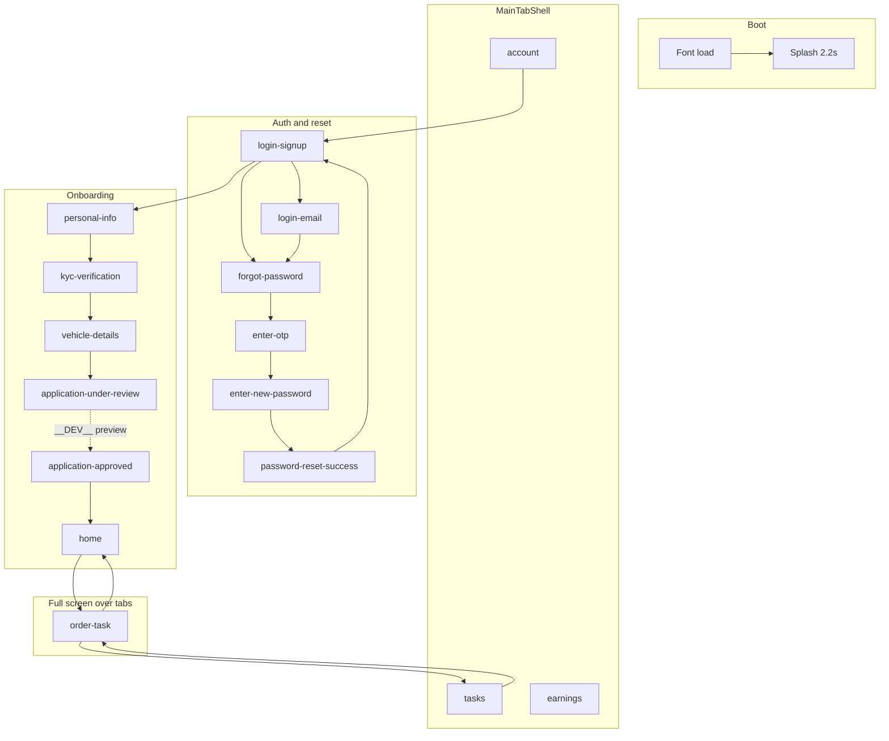

# ElectricJi app — project map

This document describes the **Expo / React Native** app under `electricji_electrician_app/`. The npm package name in `package.json` is `electicji_delivery_app` (delivery-oriented UI: tasks, vehicle, KYC, etc.).

## Tech stack

| Area | Choice |
|------|--------|
| Runtime | Expo SDK ~54 (`expo start`) |
| UI | React 19 + React Native 0.81 |
| Language | TypeScript |
| Fonts | `@expo-google-fonts/rubik`, `@expo-google-fonts/public-sans` (loaded via `expo-font` `loadAsync`) |
| Layout | `react-native-safe-area-context` |
| Graphics | `expo-linear-gradient`, `react-native-svg` |

**Navigation:** there is **no** React Navigation or Expo Router. A single `useState<AuthRoute>` in `src/App.tsx` acts as the router; screens receive `onBack` / `onNext` / etc. callbacks that call `setRoute(...)`.

## Entry point

- `index.ts` → `registerRootComponent(App)` from `./src/App`.
- `App` wraps content in `SafeAreaProvider`.

## Boot sequence

1. Load fonts (`loadAsync`); show red full-screen `ActivityIndicator` until done.
2. Show `SplashScreen` for **2200 ms** (`SPLASH_DISPLAY_MS`).
3. Render the active route (default: `login-signup`).

## Route model (`AuthRoute`)

All logical “pages” are string routes in `App.tsx`:

`login-signup` → `login-email` → `forgot-password` → `enter-otp` → `enter-new-password` → `password-reset-success` → back to `login-signup`

Onboarding / application:

`personal-info` → `kyc-verification` → `vehicle-details` → `application-under-review` → (`application-approved` in **__DEV__** only via preview) → `home`

Main app (bottom tabs):

`home` | `tasks` | `earnings` | `account`

Modal-style full screen over tabs:

`order-task` (returns to `home` or `tasks` depending on entry)

## Bottom tabs (main shell)

Defined in `src/components/MainTabBar.tsx` as `MainTabRoute`:

| Tab | Route id | Icons (Ionicons) |
|-----|----------|------------------|
| Home | `home` | `home` / `home-outline` |
| Tasks | `tasks` | `grid` / `grid-outline` |
| Earnings | `earnings` | `cube` / `cube-outline` |
| Account | `account` | `person` / `person-outline` |

`src/components/MainTabShell.tsx` renders **children** (the active tab’s screen) plus the shared `MainTabBar`. Content gets bottom padding via `useMainTabContentBottomPadding()` so it clears the fixed tab bar.

## Navigation graph (high level)

## Cross-cutting state

- **`forgotReturnRoute`:** `'login-signup' | 'login-email'` — `ForgotPasswordScreen` “back” returns to whichever screen opened forgot password.
- **`orderTaskReturnRoute`:** `'home' | 'tasks'` — `OrderTaskViewScreen` “back” returns to the tab that opened the task view.
- **`StatusBar`:** `light` on `home`, otherwise `dark`.
- **Root background:** `#f6f6f8` for main tabs, `order-task`, and `vehicle-details`; otherwise `#FFFFFF`.

## Screen files (`src/screens/`)

| File | Typical role |
|------|----------------|
| `SplashScreen.tsx` | Brand splash during boot |
| `LoginSignupScreen.tsx` | Entry auth; OTP path → onboarding, email → login email |
| `LoginEmailScreen.tsx` | Email login; back to login-signup |
| `ForgotPasswordScreen.tsx` | Password reset start |
| `EnterOtpScreen.tsx` | OTP entry |
| `EnterNewPasswordScreen.tsx` | New password |
| `PasswordResetSuccessScreen.tsx` | Success → login-signup |
| `PersonalInfoScreen.tsx` | Onboarding step 1 |
| `KycVerificationScreen.tsx` | Onboarding step 2 |
| `VehicleDetailsScreen.tsx` | Onboarding step 3 |
| `ApplicationStatusUnderReviewScreen.tsx` | Status; `onPreviewApproved` only in `__DEV__` |
| `ApplicationStatusApprovedScreen.tsx` | Approved → `home` |
| `HomeScreen.tsx` | Tab: home; can open `order-task` |
| `TasksScreen.tsx` | Tab: tasks; back/header may go `home`; open `order-task` |
| `EarningsScreen.tsx` | Tab: earnings; back → `home` |
| `AccountScreen.tsx` | Tab: account; back → `home`, logout → `login-signup` |
| `OrderTaskViewScreen.tsx` | Task detail; several action handlers are **no-ops** in `App.tsx` today |
| `MainTabPlaceholderScreen.tsx` | Present in tree; not wired in `App.tsx` (unused unless imported elsewhere) |
| `splashVectorXml.ts` | Splash asset data (not a screen) |

## Other source

- `src/hooks/useLoginScreenChrome.ts` — shared chrome for login-related layouts (used by login screens as needed).

## Assets and config

- `assets/` — icons, splash, favicon (see `app.json`).
- `app.json` — Expo config; **new architecture** enabled; Android edge-to-edge.
- `scripts/rasterize-svg-masked-pngs.mjs` — asset pipeline helper.

## How to extend navigation

1. Add a new literal to `AuthRoute` in `App.tsx`.
2. Conditionally render the screen: `route === 'your-route' && <YourScreen ... />`.
3. Pass callbacks that call `setRoute('...')`.
4. For a new **tab**, extend `MainTabRoute` in `MainTabBar.tsx`, add a tab to `TABS`, and add a branch inside `MainTabShell`’s children in `App.tsx`.

---

*Generated from the repository structure and `src/App.tsx` navigation wiring.*
